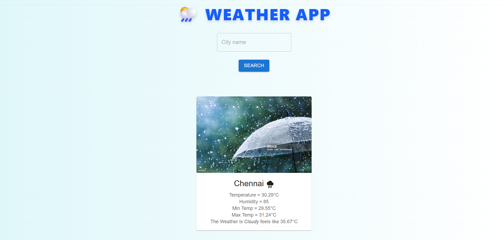

# 🌦️ Weather App

A responsive React-based weather application that fetches real-time data using the OpenWeatherMap API. Users can search for any city to view current temperature, weather conditions, and icons—all wrapped in a clean UI with gradient background and centered layout.

---

## 🚀 Features

- 🔍 City-based weather search
- 🌡️ Real-time temperature and condition display
- 📱 Mobile-responsive design
- 🎨 Styled with Tailwind CSS and custom layout tweaks
- 🖼️ Screenshot of homepage included

---

## 📸 Preview



---

## 🛠️ Tech Stack

- **Frontend**: React, Tailwind CSS
- **API**: OpenWeatherMap
- **Deployment**: Render / GitHub Pages (optional)

---

## 📦 Installation

```bash
git clone https://github.com/alimehdi13347/WeatherApp.git
cd WeatherApp
npm install
npm start
